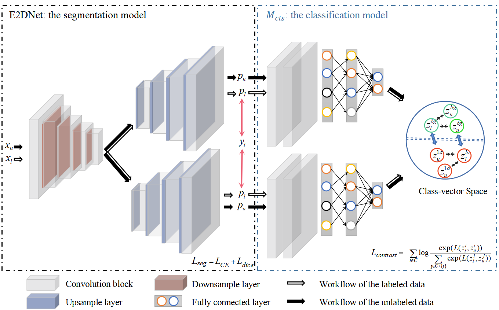

# SCC

Code for our paper "A Contrastive Consistency Semi-supervised Left Atrium Segmentation Model". 

- Proposed a class-aware semi-supervised 3D left atrium segmentaion model.
- Proposed a contrastive consistency loss function in class-level.

The pipeline of our method is shown below:

<p align="center">
     


## Requirements

Python 3.6.2

Pytorch 1.7

CUDA 11.2


## Training

**Run**

```python
train: python train_LA_semi_contrastive.py
test: python test_LA_semi_contrast.py
```

## Acknowledgment
The development of this project is based on \url[SegWithDistMap]{https://github.com/JunMa11/SegWithDistMap} and \url[UA-MT]{https://github.com/yulequan/UA-MT}
